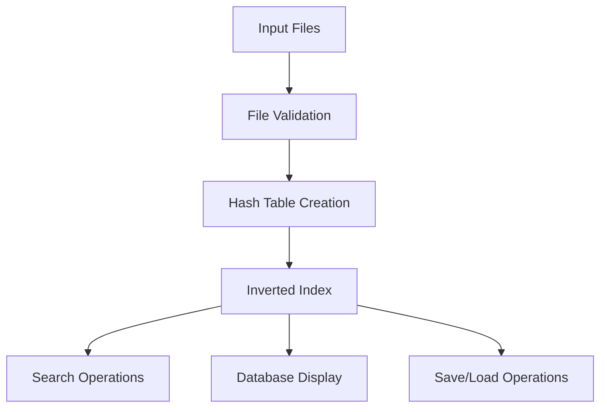
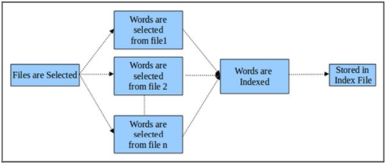
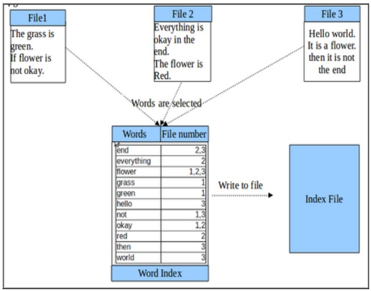
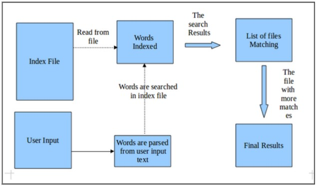
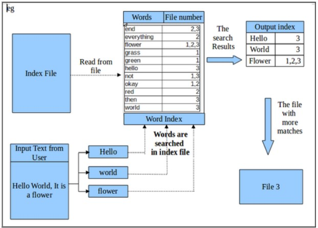

# 🔍 INVERTED SEARCH ENGINE

<div align="center">


**⚡ Optimizing Search Engine Performance with Inverted Indexing ⚡**

*A high-performance C-based search engine implementation using advanced data structures*

[🚀 Quick Start](#-quick-start) • [📖 Documentation](#-documentation) • [🛠️ Features](#️-features) • [📊 Performance](#-performance)

</div>

---

## 🌟 Overview

The **Inverted Search Engine** is a cutting-edge C application designed to revolutionize search performance through intelligent inverted indexing. By mapping content to locations within databases, it enables lightning-fast full-text searches while maintaining optimal memory usage.

### 🎯 Key Highlights

- **🔥 Blazing Fast**: Optimized search algorithms with O(1) hash table lookups
- **💾 Memory Efficient**: Smart data structures with linked lists and hashing
- **📁 Multi-File Support**: Process multiple documents simultaneously
- **🔄 Real-Time Updates**: Dynamic index updates as files are added/removed
- **💾 Persistent Storage**: Save and restore databases with custom serialization
- **🎨 Interactive UI**: Colorful terminal interface with user-friendly menus

---

## 🛠️ Features

<table>
<tr>
<td width="50%">

### 🏗️ **Core Functionality**
- ✅ **Database Creation** - Build inverted index from multiple files
- ✅ **Smart Search** - Lightning-fast word lookups with frequency data
- ✅ **Visual Display** - Formatted database viewing with statistics
- ✅ **Live Updates** - Add new files to existing database
- ✅ **Data Persistence** - Save/load database in optimized format

</td>
<td width="50%">

### ⚙️ **Technical Features**
- ✅ **Hash Table Indexing** - 27-bucket system (A-Z + symbols)
- ✅ **File Validation** - Automatic empty file detection
- ✅ **Memory Management** - Efficient linked list implementation
- ✅ **Error Handling** - Robust file I/O with validation
- ✅ **Color Interface** - ANSI escape sequences for better UX

</td>
</tr>
</table>

---

## 🚀 Quick Start

### Prerequisites
```bash
gcc (GNU Compiler Collection)
Linux/Unix environment
```

### 🔧 Installation & Build
```bash
# Clone the repository
git clone <repository-url>
cd INVERTED-SEARCH

# Build the project
make

# Run with sample files
./a.out f1.txt f2.txt f3.txt
```

### 📋 Usage
```bash
# Basic usage
./a.out file1.txt file2.txt [file3.txt ...]

# Example with provided test files
./a.out f1.txt f2.txt
```

---

## 📖 Documentation

### 🏗️ Architecture Overview



### 🔧 Core Components

#### 📊 Data Structures

```c
// File linked list for input management
typedef struct file_list {
    char *fname;
    struct file_list *link;
} File;

// Main index nodes (hash table entries)
typedef struct main_node {
    int file_c;              // File count
    char word[50];           // Indexed word
    Sub_t *sub_link;         // Sub-node pointer
    struct main_node *main_link;
} Main_t;

// Sub-nodes for file-specific data
typedef struct sub_node {
    int word_c;              // Word count in file
    char filename[50];       // File name
    struct sub_node *link;
} Sub_t;
```

#### 🎛️ Interactive Menu System

The application provides an intuitive menu-driven interface:

1. **🏗️ Create Database** - Build inverted index from input files
2. **📊 Display Database** - View complete index with statistics
3. **🔍 Search** - Find words and their occurrences
4. **🔄 Update Database** - Add data from backup files
5. **💾 Save** - Export database to backup file
6. **🚪 Exit** - Terminate application

---

## 🎨 Visual Demonstrations

### 📈 Database Creation Process
<div align="center">

<br><i>Step 1: File validation and database initialization</i>
</div>

<br>

<div align="center">

<br><i>Step 2: Building inverted index with hash table structure</i>
</div>

### 🔍 Search Operations
<div align="center">

<br><i>Step 3: Performing search queries with detailed results</i>
</div>

<br>

<div align="center">

<br><i>Step 4: Complete database visualization with statistics</i>
</div>

---

## 📊 Performance

### ⚡ Time Complexity
| Operation | Time Complexity | Description |
|-----------|----------------|-------------|
| **Insert** | O(1) average | Hash table with linked list collision resolution |
| **Search** | O(1) average | Direct hash table lookup |
| **Display** | O(n) | Linear traversal of all entries |
| **Save/Load** | O(n) | File I/O operations |

### 💾 Space Complexity
- **Hash Table**: O(27) fixed buckets
- **Index Storage**: O(n × m) where n = unique words, m = average files per word
- **Memory Efficient**: Dynamic allocation with minimal overhead

---

## 🧠 Algorithm Details

### 🔤 Hash Function
```c
// Character-based hashing for optimal distribution
int index = (toupper(word[0]) - 'A') % 26;  // A-Z → 0-25
int index = 26;  // Non-alphabetic → 26
```

### 🔗 Data Organization
- **Primary Level**: 27 hash table buckets
- **Secondary Level**: Sorted linked lists within buckets
- **Tertiary Level**: File-specific data in sub-nodes

---

## 🎯 Skills Demonstrated

<div align="center">

| **Core Programming** | **Data Structures** | **System Programming** |
|:-------------------:|:------------------:|:---------------------:|
| 🅲 Advanced C | 🔗 Linked Lists | 📁 File Operations |
| 🎯 Pointers | 🗂️ Hash Tables | ⚡ Bitwise Operations |
| 🧮 Algorithms | 🌳 Tree Structures | 🖥️ Command Line Args |

</div>

---

## 🤝 Contributing

We welcome contributions! Here's how you can help:

1. 🍴 **Fork** the repository
2. 🌿 **Create** a feature branch (`git checkout -b feature/AmazingFeature`)
3. ✅ **Commit** your changes (`git commit -m 'Add some AmazingFeature'`)
4. 📤 **Push** to the branch (`git push origin feature/AmazingFeature`)
5. 🔄 **Open** a Pull Request

---

## 📜 License

This project is licensed under the MIT License - see the [LICENSE](LICENSE) file for details.